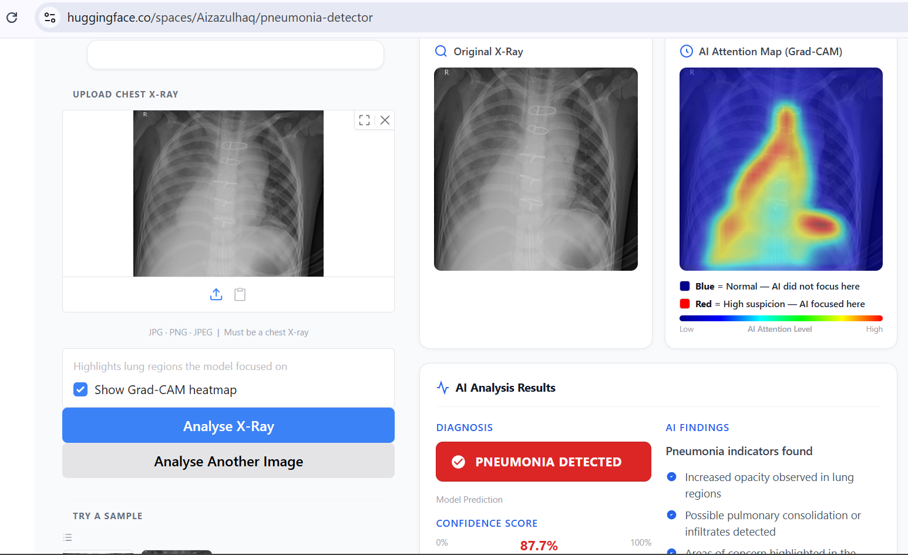

# 🫁 Chest X-Ray Pneumonia Detector

> AI-powered pneumonia detection from paediatric chest X-rays with Grad-CAM explainability — built and deployed end-to-end .

[](https://huggingface.co/spaces/Aizazulhaq/pneumonia-detector)
[](https://github.com/Aizaz-ull-haq/pneumonia-detector)

---

## 🔗 Live Demo
👉 **[Try it here → huggingface.co/spaces/Aizazulhaq/pneumonia-detector](https://huggingface.co/spaces/Aizazulhaq/pneumonia-detector)**



---

##  Features

-  Classifies chest X-rays as **Normal** or **Pneumonia**
-  **Grad-CAM heatmap** — shows exactly which lung regions the AI focused on
-  Input validation — automatically rejects non-X-ray images
-  Confidence score with visual indicator
-  Responsive UI — works on desktop and mobile
-  Paediatric dataset notice shown clearly in the UI

---

##  Model Architecture

```
Input (150 × 150 × 3)
         ↓
Conv2D(32) → BatchNorm → Conv2D(32) → MaxPool → Dropout
         ↓
Conv2D(64) → BatchNorm → Conv2D(64) → MaxPool → Dropout
         ↓
Conv2D(128) → BatchNorm → Conv2D(128) → MaxPool → Dropout
         ↓
Flatten → Dense(512) → BatchNorm → Dropout
         ↓
Dense(1, activation='sigmoid')
         ↓
    Normal / Pneumonia
```

| Property | Detail |
|----------|--------|
| Loss | Binary Crossentropy |
| Optimizer | Adam |
| Input size | 150 × 150 × 3 |
| Output | Sigmoid (binary) |
| Grad-CAM layer | `conv2d_5` (final Conv2D) |

---

##  Dataset

| Property | Detail |
|----------|--------|
| Name | Chest X-Ray Images (Pneumonia) |
| Source | [Kaggle — Paul Mooney](https://www.kaggle.com/datasets/paultimothymooney/chest-xray-pneumonia) |
| Total images | 5,863 |
| Classes | Normal / Pneumonia |
| Patient age group | Children aged 1–5 years |
| Origin | Guangzhou Women and Children's Medical Center, China |

> ⚠️ **Important limitation:** This model is trained exclusively on
> **paediatric** chest X-rays. Results on adult X-rays will be unreliable.

---

##  Tech Stack

| Component | Technology |
|-----------|------------|
| Deep Learning | TensorFlow / Keras |
| Explainability | Grad-CAM (Gradient-weighted Class Activation Mapping) |
| Web Interface | Gradio |
| Deployment | HuggingFace Spaces |
| Language | Python 3.11 |
| Image Processing | OpenCV, Pillow |

---

##  Run Locally

```bash
# 1. Clone the repository
git clone https://github.com/Aizaz-ull-haq/pneumonia-detector
cd pneumonia-detector

# 2. Install dependencies
pip install -r requirements.txt

# 3. Add the model file
# The model (246MB) exceeds GitHub's limit so it is not in this repo.
# Download it from HuggingFace Spaces and place it here:
# pneumonia-detector/pneumonia_cnn_model.keras

# 4. Run the app
python app.py

# 5. Open in browser
# http://localhost:7860
```

---

## 📁 Project Structure

```
pneumonia-detector/
├── app.py                      # Main Gradio app + Grad-CAM logic
├── requirements.txt            # Python dependencies
├── README.md                   # This file
├── .gitignore                  # Git ignore rules
├── screenshot.png              # App screenshot
└── examples/
    ├── normal.jpeg             # Sample normal chest X-ray
    └── pneumonia.jpeg          # Sample pneumonia chest X-ray
```

---

## 🔍 How Grad-CAM Works

Grad-CAM (Gradient-weighted Class Activation Mapping) shows **why** the model made its decision:

1. A forward pass runs through the CNN
2. Gradients of the prediction are computed with respect to the final Conv2D layer (`conv2d_5`)
3. These gradients are averaged across channels to get importance weights
4. A weighted sum of feature maps produces a heatmap
5. The heatmap is overlaid on the original X-ray

**Red = high attention** (model found this region suspicious)
**Blue = low attention** (model ignored this region)

---

## ⚠️ Medical Disclaimer

This tool is for **educational and research purposes only**.
It is **not** a substitute for clinical diagnosis by a qualified
physician or radiologist. Always consult a medical professional.

---

## 👨‍💻 Author

**Aizaz ul Haq**

🔗 [LinkedIn](www.linkedin.com/in/aizaz-ull-haq)
🤗 [HuggingFace](https://huggingface.co/Aizazulhaq)
💻 [GitHub](https://github.com/Aizaz-ull-haq)

---

## License

This project is open source and available under the [MIT License](LICENSE).
